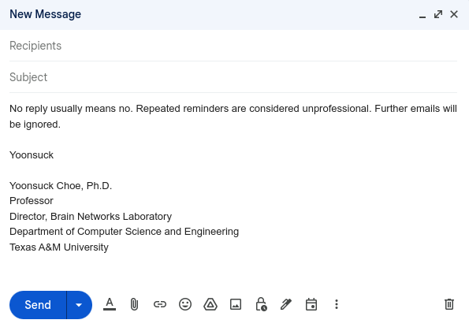

# gmail-hotkey

Chrome extension to define a shortcut key to insert a customizable text string into the gmail compose window. 

The code was written using Claude. Initial attemps with ChatGPT and Gemini failed. 

### How to install and use 

1. Go to `chrome://extensions`
1. On the upper right corner, activate `Developer mode`

   
1. On the upper left corner, click on `( Load unpacked )`, then click on the folder where you've put these files.
   
1. Go to `chrome://extensions/shortcuts`
1. In the `Activate the extension` window, press `[Alt]+[Shift]+[,]`
   
1. Go to gmail, open a compose window then press `[Alt]+[Shift]+[,]`
1. Define your macro and `[Save]`.

   
1. Go to the gmail compose window and press `[Ctrl]+[Shift]+[,]`
   

### Known bugs

1. Only tested in Linux. 

1. Need to activate when you switch to a different machine.

